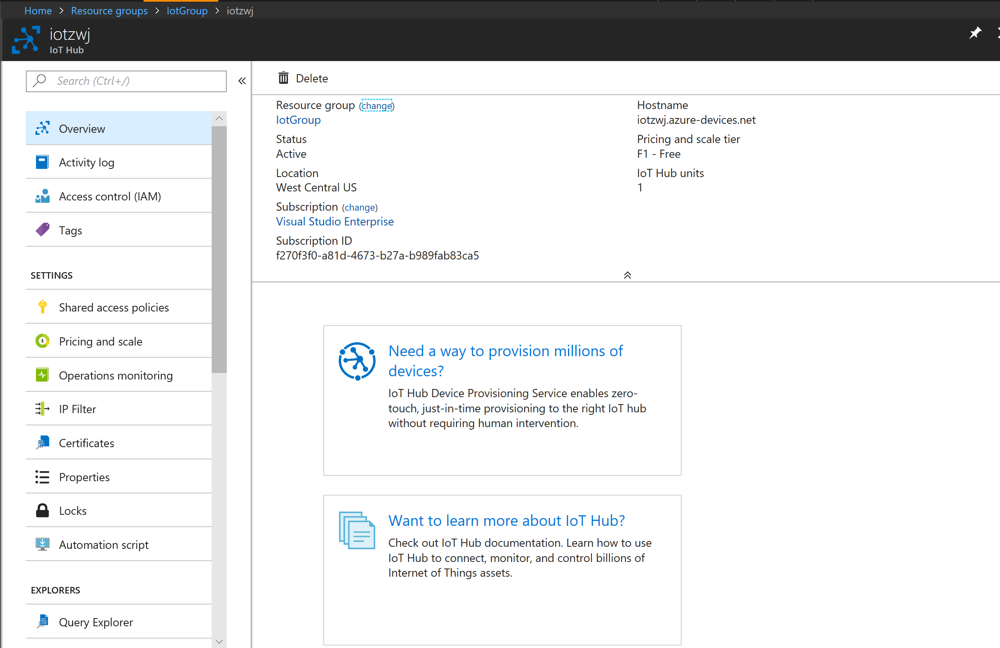
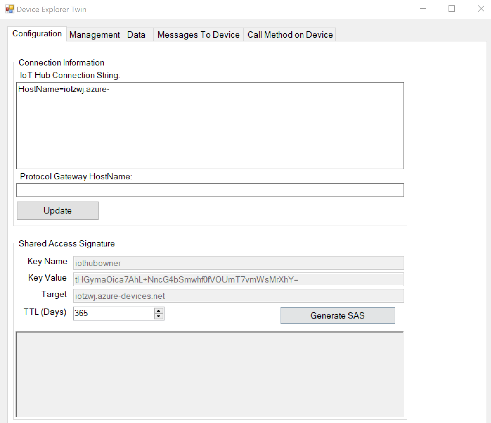
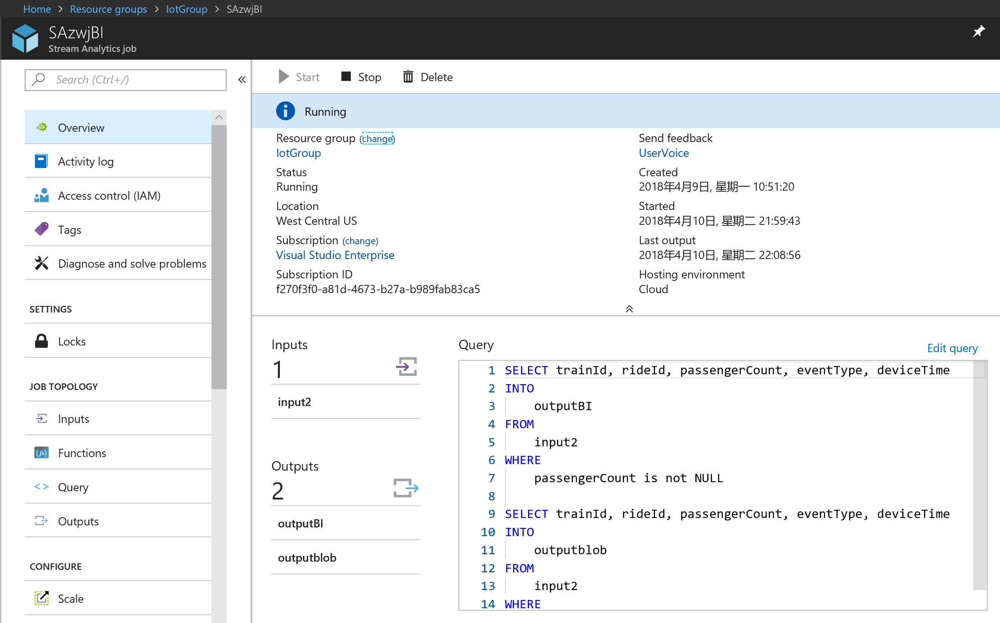
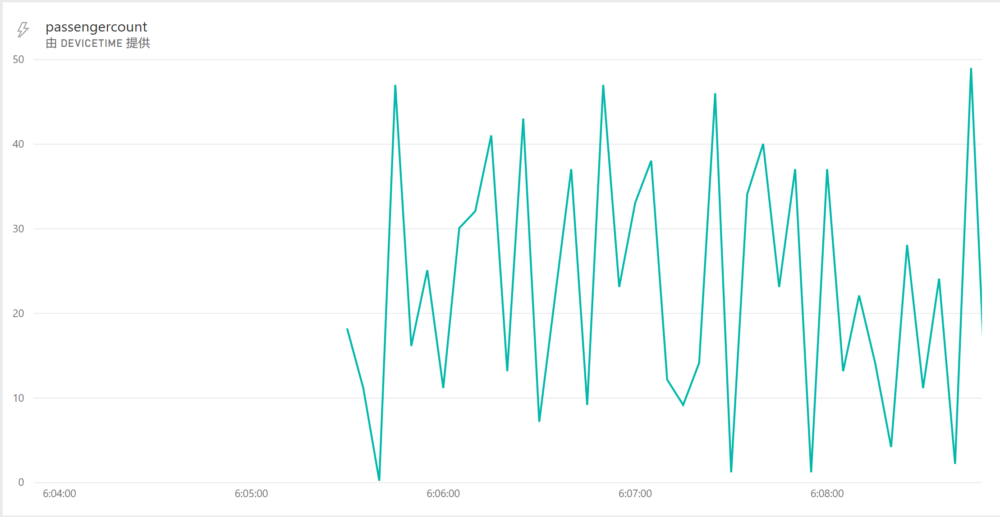

# QingDao_iot_Hack_pythonDemo  

该demo为[QingDao_iot_hack](https://github.com/Nick287/IoT-Hastfest-Qingdao)挑战的参考

## 挑战1

### 步骤 1 - 在 Azure 门户中创建一个 IoT Hub  
该步骤可以直接参考文档完成Azure门户中iot hub的创建

### 步骤 2 - 向IoT Hub发送消息
在物联网技术实际场景使用中，我们需要利用设备与云端进行通信。为了更好的对接设备，我们需要在本地PC机上模拟设备进行数据上传。  
因此，发送消息之前，我们需要创建设备标识，参考如下两种方法：  
1. 在Azure 门户中[创建设备](https://docs.microsoft.com/en-us/azure/iot-hub/iot-hub-csharp-csharp-device-management-get-started)
2. 参考代码中CreateDeviceIdentity.py，使用iot hub SDK创建设备标识

建立设备标识之后我们需要向云端发送消息：
1. 参考代码中SimulatedVisitorDevice.py，使用iot hub SDK发送信息到iot hub上。
2. 注意发送信息时json文格式的处理

### 步骤 3 - 使用Azure IoT Hub Device Explorer检查数据上传结果  
下载文档上相关的软件进行安装，在Explorer中可以添加iot hub的配置信息进行信息监控

## 挑战2

### 步骤 1 模拟云霄飞车数据并且数据上传到 IoT Hub
此处模拟云霄飞车的数据可以通过多线程的方式处理，而对于Python这样的解释型语言，多线程的意义不大，也可以通过多进程或者开启多个处理窗口的方式进行处理。  
可以参考代码SimulatedRollerCoaster.py，发送云霄飞车数据到云端。  

### 步骤 2 Stream Processing / 流分析
通过创建流分析服务，可以配置输入为iot hub,输出为存储或者直接显示到PowerBI, 注意其中使用者组的创建。  
其中当遇到多个输出需要配置时，可以在流分析工具中配置不同的输出进行处理。  
此处可以注意数据中不能出现空的情况，如果有需要在流分析中进行过滤。
流分析中SQL语句示例可以参考SQL.txt文件。

### 步骤 3 Data Archival / 数据归档
由于iot hub没有数据存储的能力，我们需要将数据进行存储，同时，可以通过存储检验数据的输出是否正确。
检验数据是否正常上传到blob中可以通过下载blob中的文件进行检验。  
如代码中.json文件。

### 步骤 4 生成报告
流分析服务中可以编写相关SQL语句进行信息的筛选。  
PowerBI中注意图表需要实时进行信息的更新，需要设定消息的时间窗口。
示例powerbi展示如图

